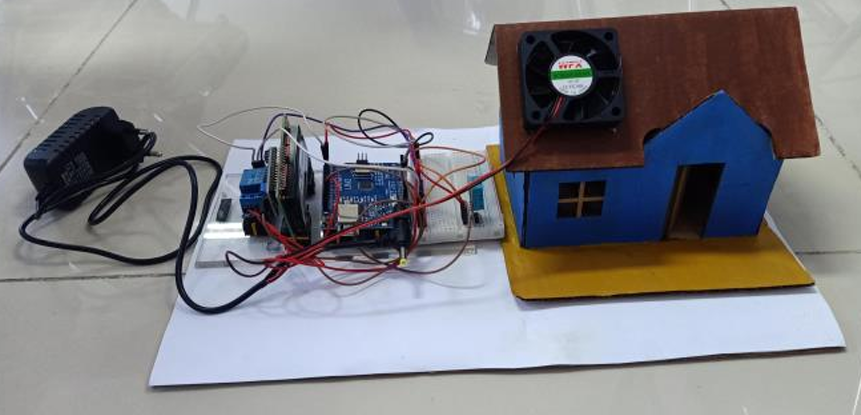
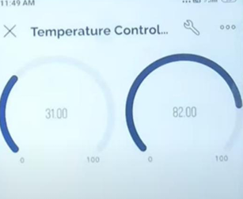

# Smart Temperature Control System Using Arduino & IoT

Automatic Fan Control Based on Real-Time Temperature Monitoring

        

  

-Overview

This project implements a smart automatic fan system using an Arduino Uno, DHT11 temperature sensor, and LCD I2C display.

The system monitors room temperature in real-time and automatically activates the fan whenever the temperature exceeds the predefined threshold.

Designed with an IoT concept, this project can also be integrated with platforms like Blynk for remote monitoring and automation.

- Features
1. Real-time temperature monitoring
2. Humidity detection using DHT11
3. Automatic fan activation
4. LCD I2C live display
5. Energy-efficient automation
6. IoT-based system concept
7. Simple and low-cost implementation

-Research Results

- *Successful real-time temperature monitoring*  
- *Automatic fan activation based on temperature threshold*  
- *Effective room temperature control*  
- *IoT integration supports remote monitoring systems*

- Tools & Technologies:

  
  

<i>Arduino Uno • Arduino IDE • C++ • DHT11 Sensor • LCD I2C • Blynk.ic • IoT • GitHub • Sensor Automation</i>

- Project Demo

YouTube Demo:  
https://youtu.be/LOQQ63-ZFcg?si=axWovNdM2JsyGpZH

-Conclusion

This project demonstrates how IoT technology and Arduino can be integrated to create a smart automatic temperature control system.
By combining sensors, automation, and real-time monitoring, the system provides a practical solution for improving comfort and energy efficiency.
